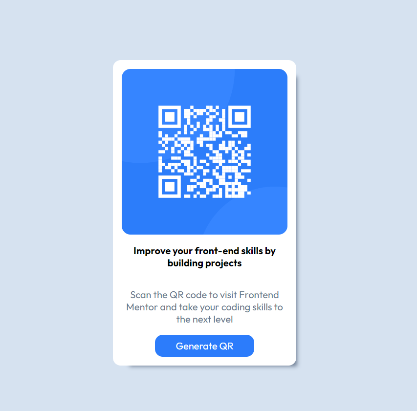
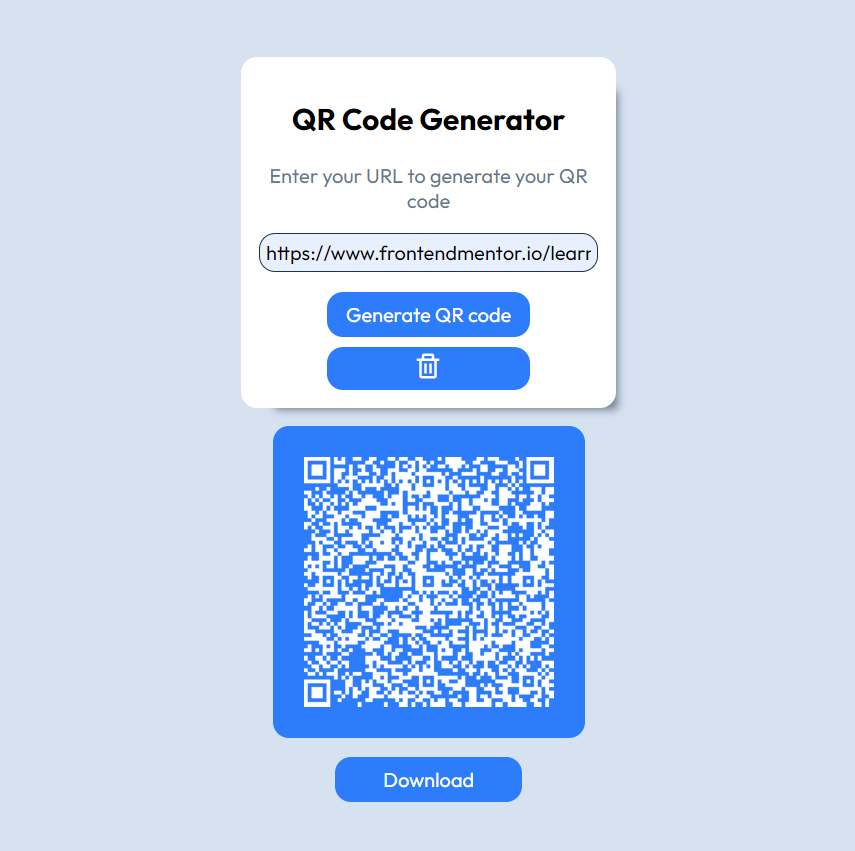

# Frontend Mentor - QR code component solution

## Overview
I created a qr component, but also a qr generator, with download button and some other functinality.
Probably I'll adding more features on the future...

It was building with sample html, css and Javascript.

### Screenshot

### Links
