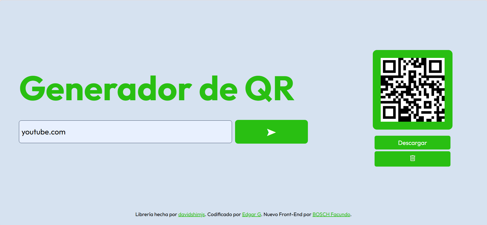

# Generador de códigos QR

## Overview

Consiste en una página web, completamente de Front-End, que permite generar QR's de manera sencilla. 
Pon el link, presiona el botón y listo.

This is a website fully coded in Front-End, allows you to generate QR codes easily.
Input URL, press the button and you are done.

### Screenshot

### Links

Librería de JavaScript creada por: davidshimjs
    https://github.com/davidshimjs
Código original de la página web por: Edgar G
    https://github.com/EdgarAleG/qr-generator
Nueva adaptación de Front-End por: BOSCH Facundo
    https://github.com/FacundoBosch/qrcode-generator